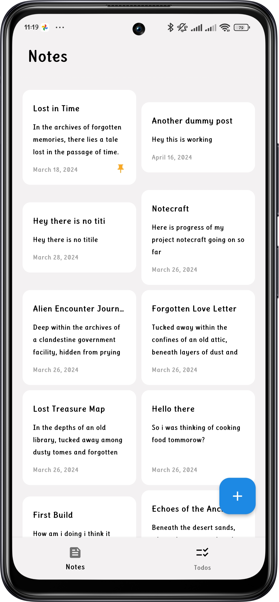
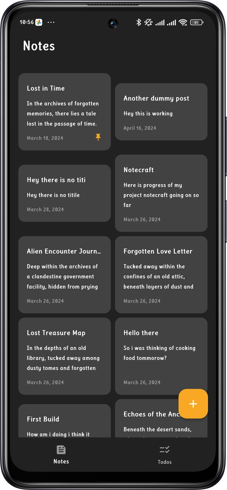
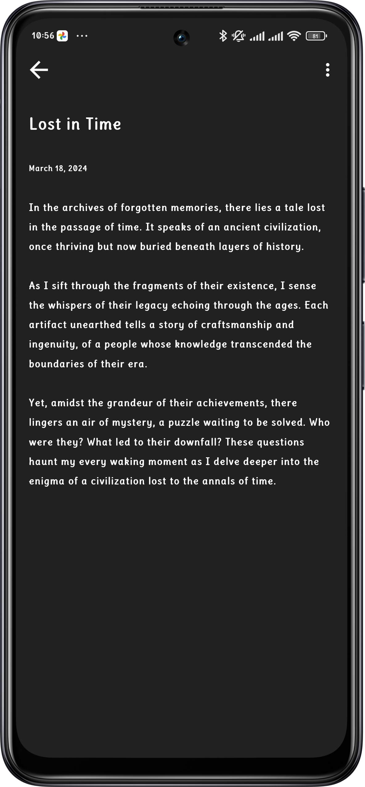
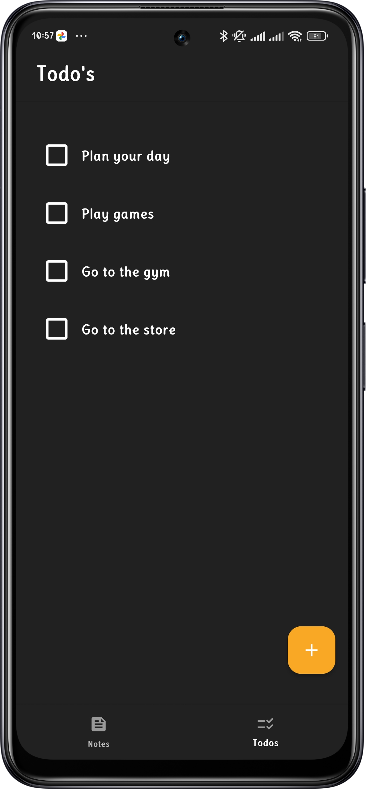
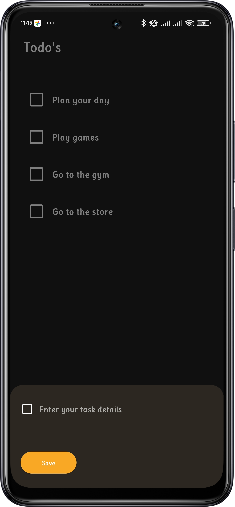

# Notecraft

Notecraft is a versatile note-taking app with an integrated to-do list. It includes features such as pinned notes and support for dark mode. The app is built using Flutter, ensuring a smooth and responsive user experience across multiple platforms.

## Features

- **Pinned Notes**: Keep your important notes at the top for easy access.
- **To-Do List**: Organize your tasks and manage your time effectively.
- **Dark Mode**: Reduce eye strain and save battery life with dark mode support.

## Screenshots

<div style="display: flex; flex-wrap: wrap; gap: 10px;">

<div style="flex: 1; min-width: 45%;">
  <h3>Home Screen</h3>
  
</div>

<div style="flex: 1; min-width: 45%;">
  <h3>Home Screen Dark Mode</h3>
  
</div>

<div style="flex: 1; min-width: 45%;">
  <h3>View Note</h3>
  
</div>

<div style="flex: 1; min-width: 45%;">
  <h3>To-Do List</h3>
  
</div>

<div style="flex: 1; min-width: 45%;">
  <h3>Add To-Do List</h3>
  
</div>

</div>

## Installation

To get started with Notecraft, follow these steps:

1. **Clone the repository**:
    ```bash
    git clone https://github.com/abramaleko/notecraft.git
    ```
2. **Navigate to the project directory**:
    ```bash
    cd notecraft
    ```
3. **Install dependencies**:
    ```bash
    flutter pub get
    ```
4. **Run the app**:
    ```bash
    flutter run
    ```

## Usage

- **Creating a Note**: Tap the "New Note" button to create a new note. You can enter your text and save it.
- **Pinning a Note**: Tap the pin icon on a note to pin it to the top.
- **Managing To-Do List**: Add items to your to-do list, mark them as completed, or delete them as needed.
- **Switching to Dark Mode**: Go to the settings and toggle the dark mode option.

## Contributing

We welcome contributions to Notecraft! To contribute:

1. Fork the repository.
2. Create a new branch (`git checkout -b feature-branch`).
3. Make your changes and commit them (`git commit -m 'Add new feature'`).
4. Push to the branch (`git push origin feature-branch`).
5. Open a Pull Request.

Please ensure your changes are well-documented and pass all tests.

## License

This project is licensed under the MIT License - see the [LICENSE](LICENSE) file for details.

## Contact

If you have any questions or suggestions, feel free to contact me at [abrahammaleko@gmail.com](mailto:your.email@example.com).

---

Thank you for using Notecraft!
